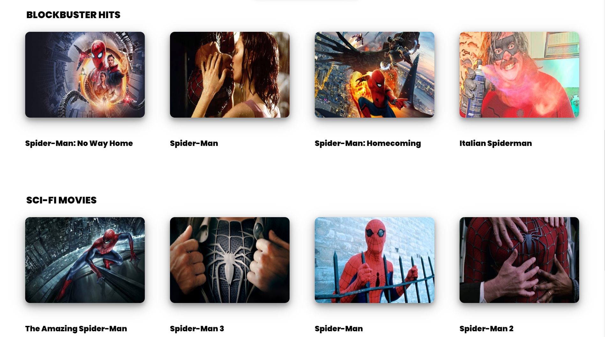

# Movie Searcher  
Languages Used : HTML, CSS, Javascript
## Browsing movies:
There's a search bar at the top of the home page. We need to provide a keyword in it.  
Let us take "spiderman" for example and press ENTER.   
   
      
Then we will get related movies to the keyword in image boxes present further down on the web page.   

